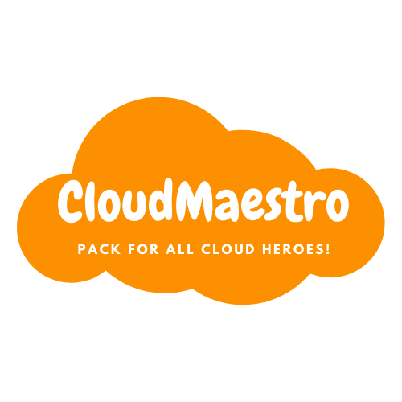

# Cloud Maestro Pack

Cloud Maestro Pack is developed for making the process of Native Cloud Development easier and efficient.

---

## Productivity Extensions

[alefragnani.Bookmarks](https://marketplace.visualstudio.com/items?itemName=alefragnani.Bookmarks)

#### Bookmarks

- Adds **Virtual Workspaces** support

- Adds **Workspace Trust** support

- Full **Remote Development** support

- Improved **Multi-root** support

- Adds **Cross-platform** support

- Improved **Side Bar** usability

---

#### Bracket Pair Colorizer 2

[CoenraadS.bracket-pair-colorizer-2](https://marketplace.visualstudio.com/items?itemName=CoenraadS.bracket-pair-colorizer-2)

- Allows matching brackets to be identified with colours.
- The user can define which tokens to match, and which colours to use.

---

#### Github Copilot

[GitHub.copilot](https://marketplace.visualstudio.com/items?itemName=GitHub.copilot)

- An AI pair programmer which suggests line completions and entire function bodies as you type.
- Powered by the OpenAI Codex AI system, trained on public Internet text and billions of lines of code.

---

### Remote Access Extensions

#### Remote Containers

[ms-vscode-remote.remote-containers](https://marketplace.visualstudio.com/items?itemName=ms-vscode-remote.remote-containers)

- Develop with a consistent, easily reproducible toolchain on the same operating system you deploy to.
- Quickly swap between different, separate development environments and safely make updates without worrying about impacting your local machine.
- Make it easy for new team members / contributors to get up and running in a consistent development environment.
- Try out new technologies or clone a copy of a code base without impacting your local setup.

---

#### Remote SSH

[ms-vscode-remote.remote-ssh](https://marketplace.visualstudio.com/items?itemName=ms-vscode-remote.remote-ssh)

- Develop on the same operating system you deploy to or use larger, faster, or more specialized hardware than your local machine.
- Quickly swap between different, remote development environments and safely make updates without worrying about impacting your local machine.
- Access an existing development environment from multiple machines or locations.
- Debug an application running somewhere else such as a customer site or in the cloud.

---

#### Remote WSL

[ms-vscode-remote.remote-wsl](https://marketplace.visualstudio.com/items?itemName=ms-vscode-remote.remote-wsl)

- Lets you use VS Code on Windows to build Linux applications that run on the Windows Subsystem for Linux

---

### Programming Extensions

#### Code Runner

[formulahendry.code-runner](https://marketplace.visualstudio.com/items?itemName=formulahendry.code-runner)

- Run code snippet or code file for multiple languages: C, C++, Java, JavaScript, PHP, Python, Perl, Perl 6, Ruby, Go, Lua, Groovy, PowerShell, BAT/CMD, BASH/SH, F# Script, F# (.NET Core), C# Script, C# (.NET Core), VBScript, TypeScript, CoffeeScript, Scala, Swift, Julia, Crystal, OCaml Script, R, AppleScript, Elixir, Visual Basic .NET, Clojure, Haxe, Objective-C, Rust, Racket, Scheme, AutoHotkey, AutoIt, Kotlin, Dart, Free Pascal, Haskell, Nim, D, Lisp, Kit, V, SCSS, Sass, CUDA, Less, Fortran, and custom command

---

#### Python

[ms-python.python](https://marketplace.visualstudio.com/items?itemName=ms-python.python)

- The Python extension will automatically install the Pylance and Jupyter extensions to give you the best experience when working with Python files and Jupyter notebooks. 

---

#### Go

[golang.go](https://marketplace.visualstudio.com/items?itemName=golang.go)

- Provides rich language support for the Go programming language.

---

#### PowerShell

[ms-vscode.powershell](https://marketplace.visualstudio.com/items?itemName=ms-vscode.powershell)

- Provides rich PowerShell language support 

---

### DevOps Extensions

#### GitLens

[eamodio.gitlens](https://marketplace.visualstudio.com/items?itemName=eamodio.gitlens)

- Effortless revision navigation (backwards and forwards) through the history of a file

- An unobtrusive current line blame annotation at the end of the line showing the commit and author who last modified the line, with more detailed blame information accessible on hover

- Authorship code lens showing the most recent commit and number of authors at the top of files and/or on code blocks

- A status bar blame annotation showing the commit and author who last modified the current line

- On-demand file annotations in the editor gutter, including
    - Blame — shows the commit and author who last modified each line of a file
    - Changes — highlights any local (unpublished) changes or lines changed by the most recent commit
    - Heatmap — shows how recently lines were changed, relative to all the other changes in the file and to now (hot vs. cold)

- Many rich Side Bar views
- Github Command Palette to provide guided (step-by-step) access to many common Git commands, as well as quick access to
  - Commits
  - Stashes
  - Status

- An user-friendly interactive rebase editor to easily configure an interactive rebase session

- Terminal links — `ctrl+click` on autolinks in the integrated terminal to quickly jump to more details for commits, branches, tags, and more

- rich remote provider integrations
  — GitHub, GitLab, Gitea, Bitbucket, Azure DevOps
  - issue and pull request auto-linking
  - rich hover information provided for linked issues and pull requests (GitHub only)
  - associates pull requests with branches and commits (GitHub only)

- many powerful commands for navigating and comparing revisions and more

- customizable menus & toolbars for control over where menu and toolbar items are shown

- user-defined modes for quickly toggling between sets of settings

- and so much more 😁

---

#### Docker

[ms-azuretools.vscode-docker](https://marketplace.visualstudio.com/items?itemName=ms-azuretools.vscode-docker)

- Makes it easy to build, manage, and deploy containerized applications from Visual Studio Code.

---

#### Kubernetes

[ms-kubernetes-tools.vscode-kubernetes-tools](https://marketplace.visualstudio.com/items?itemName=ms-kubernetes-tools.vscode-kubernetes-tools)

- For developers building applications to run in Kubernetes clusters and for DevOps staff troubleshooting Kubernetes applications.
- Features include:
  - View your clusters in an explorer tree view, and drill into workloads, services, pods and nodes.
  - Browse Helm repos and install charts into your Kubernetes cluster.
  - Intellisense for Kubernetes resources and Helm charts and templates.
  - Edit Kubernetes resource manifests and apply them to your cluster.
  - Build and run containers in your cluster from Dockerfiles in your project.
  - View diffs of a resource's current state against the resource manifest in your Git repo
  - Easily check out the Git commit corresponding to a deployed application.
  - Run commands or start a shell within your application's pods.
  - Get or follow logs and events from your clusters.
  - Forward local ports to your application's pods.
  - Create Helm charts using scaffolding and snippets.
  - Watch resources in the cluster explorer and get live updates as they change

---

#### HashiCorp Terraform

[hashicorp.terraform](https://marketplace.visualstudio.com/items?itemName=hashicorp.terraform)

- Manages installation and updates of the Terraform Language Server (terraform-ls), exposing its features:

  - Completion of initialized providers: resource names, data source names, attribute names
  - Diagnostics to indicate HCL errors as you type
  - Initialize the configuration using "Terraform: init" from the command palette
  - Run `terraform plan` and `terraform apply` from the command palette
  - Validation diagnostics using "Terraform: validate" from the command palette or a `validateOnSave` setting

- Includes syntax highlighting for `.tf` and `.tfvars` files -- including all syntax changes new to Terraform 0.12
- Closes braces and quotes
- Includes `for_each` and `variable` syntax shortcuts (`fore`, `vare`, `varm`)

---

#### Ansible

[tomaciazek.ansible](https://marketplace.visualstudio.com/items?itemName=tomaciazek.ansible)

- Adds language support for Ansible

---

### Jira and Bitbucket

[atlassian.atlascode](https://marketplace.visualstudio.com/items?itemName=atlassian.atlascode)

-  Combines the power of Jira and Bitbucket to streamline the developer workflow

---

### Database 

#### Oracle-plsql

[mycelo.oracle-plsql](https://marketplace.visualstudio.com/items?itemName=mycelo.oracle-plsql)

- Provides syntax highlighting for Oracle's proprietary PL/SQL database programming language.

---

#### MySQL

[cweijan.vscode-mysql-client2](https://marketplace.visualstudio.com/items?itemName=cweijan.vscode-mysql-client2)

- Supports databases MySQL/MariaDB, Microsoft SQL Server, PostgreSQL, SQLite, MongoDB, Redis, and ElasticSearch.

---

#### MongoDB

[mongodb.mongodb-vscode](https://marketplace.visualstudio.com/items?itemName=mongodb.mongodb-vscode)

- Navigate your MongoDB Data
- MongoDB Playgrounds
- Document Editing
- Quick access to the MongoDB Shell
- Terraform snippet for MongoDB Atlas

---

### Cloud 

#### AWS Toolkit

[amazonwebservices.aws-toolkit-vscode](https://marketplace.visualstudio.com/items?itemName=amazonwebservices.aws-toolkit-vscode)

- An extension for Visual Studio Code that enables you to interact with Amazon Web Services (AWS).

---

### Azure Tools

[ms-vscode.vscode-node-azure-pack](https://marketplace.visualstudio.com/items?itemName=ms-vscode.vscode-node-azure-pack)

- A rich set of extensions that make it easy to discover and interact with the Azure.

---

### Auxiliary

### Prettify JSON

[mohsen1.prettify-json](https://marketplace.visualstudio.com/items?itemName=mohsen1.prettify-json)

- Prettify ugly JSON

---

### YAML

[redhat.vscode-yaml]()https://marketplace.visualstudio.com/items?itemName=redhat.vscode-yaml

- Provides comprehensive YAML Language support to Visual Studio Code, via the yaml-language-server, with built-in Kubernetes syntax support.

---

### Material Icon Theme

[PKief.material-icon-theme](https://marketplace.visualstudio.com/items?itemName=PKief.material-icon-theme)

---

